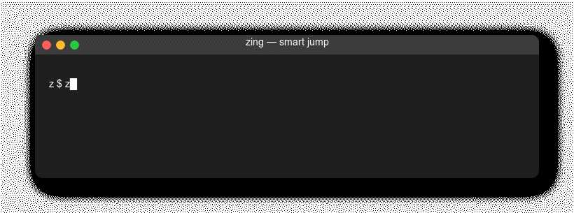
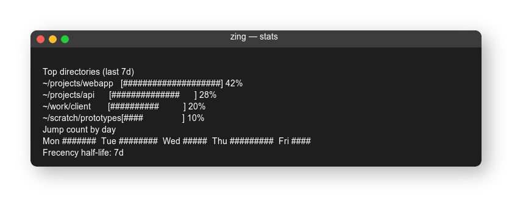
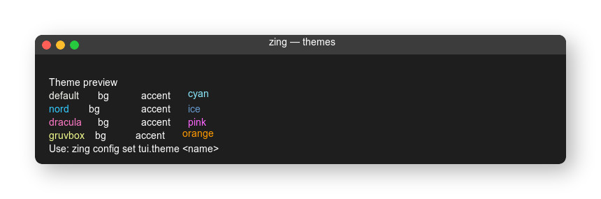

<div align="center">


A modern directory jumper with a visual-first TUI, built in Zig.

[Key Features](#key-features) • [Usage](#usage) • [Install](#install) • [Customize](#customize) • [FAQ](#faq)

[English](README.md) | [日本語](doc/README-ja.md)

[](https://github.com/ydah/zing/actions)
[](LICENSE)
[](https://github.com/ydah/zing/releases)

</div>

zing learns where you work and lets you jump there instantly. It combines fuzzy matching, frecency scoring (frequency + recency), and an interactive TUI with live preview, tree view, and stats.

---

## Key Features

### Smart Jump with Fuzzy Matching

Type fragments of a path and zing finds the best match instantly.



### Interactive TUI (List, Preview, Tree, Stats)

Launch `zi` for a visual selector with live search, preview, and score bars.


### Frecency Scoring

Favor both *how often* and *how recently* you visit directories.

| Directory | Score | Last Access |
| --- | --- | --- |
| `~/projects/webapp` | 156.2 | 2 min ago |
| `~/projects/api` | 89.4 | 1 hour ago |
| `~/work/client` | 52.1 | 1 day ago |

### Subdirectory Jump

Jump to a parent, then refine to a child.

```bash
z pro /src    # -> ~/projects/webapp/src
```

### Tree View and Stats Dashboard

Inspect directory hierarchy and usage trends at a glance.




### Themes

Four built-in themes: `default`, `nord`, `dracula`, `gruvbox`.



---

## Usage

### Basic Commands

```bash
# Jump to the best match
z foo

# AND search across multiple terms
z foo bar

# Interactive selector (TUI)
zi
zi foo
```

### Subdirectory Mode

```bash
z foo /        # enter subdirectory selection
z foo /src     # jump to a specific subdir
```

### Admin Commands

```bash
zing add ~/new-project
zing remove ~/old-dir
zing list
zing list --format=json
zing stats
```

---

## Install

### Build from source (Zig 0.15.x)

```bash
git clone https://github.com/ydah/zing.git
cd zing
zig build -Doptimize=ReleaseFast
sudo cp zig-out/bin/zing /usr/local/bin/
```

### Shell integration

```bash
# bash
source <(zing init bash)

# zsh
eval "$(zing init zsh)"

# fish
zing init fish | source
```

---

## Migrate from other tools

```bash
# zoxide
zing import --from=zoxide

# z (rupa/z)
zing import --from=z ~/.z

# autojump
zing import --from=autojump
```

---

## Integrations

### fzf

```bash
z "$(zing list --format=text | fzf)"
```

### Neovim / Vim

```vim
command! -nargs=* Z :cd `zing query <args>`
```

### tmux

```bash
bind-key j display-popup -E "zi"
```

---

## Customize

### Themes

```bash
zing config themes
zing config set tui.theme nord
```

### Config file

Default path: `~/.config/zing/config.toml` (override with `ZING_CONFIG`).

```toml
[general]
data_dir = "~/.local/share/zing"
cmd_alias = "z"
interactive_alias = "zi"

[scoring]
half_life = 604800
match_weight = 1.0
max_score = 1000.0
min_score = 0.01

[matching]
case_sensitivity = "smart"
search_type = "fuzzy"

[tui]
theme = "default"
show_preview = true
show_score_bar = true
highlight_matches = true

[exclude]
patterns = [
  "^/tmp",
  ".*/node_modules/.*",
  ".*/\\.git/.*",
]
```

### Environment variables

| Variable | Description | Default |
| --- | --- | --- |
| `ZING_DATA_DIR` | Database location | `~/.local/share/zing` |
| `ZING_CONFIG` | Config file path | `~/.config/zing/config.toml` |

---

## FAQ

### z/zi commands are not found

Check that shell integration is installed:

```bash
grep zing ~/.bashrc  # or ~/.zshrc
```

### A directory is missing from results

Add it manually once:

```bash
zing add /path/to/dir
```

### Reset scores

```bash
rm ~/.local/share/zing/zing.db
```

### TUI looks broken

Make sure your terminal supports true color:

```bash
echo $COLORTERM
```

---

## Comparison

| Feature | zing | zoxide | z | autojump |
| --- | --- | --- | --- | --- |
| Language | Zig | Rust | Shell | Python |
| Interactive TUI | ✅ | fzf-based | ❌ | ❌ |
| Frecency (continuous) | ✅ | ✅ (discrete) | ✅ (discrete) | ❌ |
| Subdirectory jump | ✅ | ✅ | ❌ | ❌ |
| Tree view | ✅ | ❌ | ❌ | ❌ |
| Stats dashboard | ✅ | ❌ | ❌ | ❌ |
| Themes | ✅ | ❌ | ❌ | ❌ |

---

## Project Goals

- Fast: cold start < 10ms, query < 5ms
- Visual-first: live TUI with preview and tree view
- Smart defaults: useful out of the box, zero-config
- Customizable: themes, exclusions, tuning knobs

---

## Development

```bash
# Debug build
zig build

# Release build
zig build -Doptimize=ReleaseFast

# Tests
zig build test
```

Contributions welcome. See `CONTRIBUTING.md` for workflow and style.

---

## License

MIT. See `LICENSE`.

## Credits

- [zoxide](https://github.com/ajeetdsouza/zoxide) for inspiration
- [libvaxis](https://github.com/rockorager/libvaxis) for the TUI
- [z](https://github.com/rupa/z) for the frecency concept
